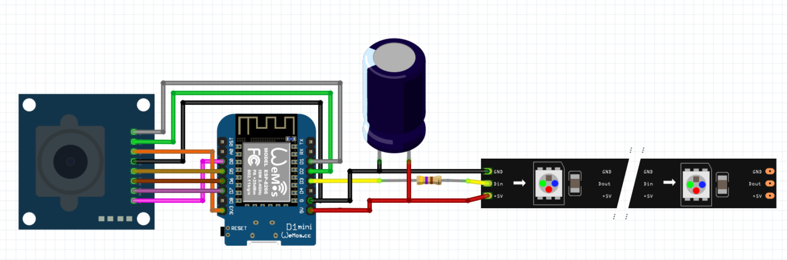
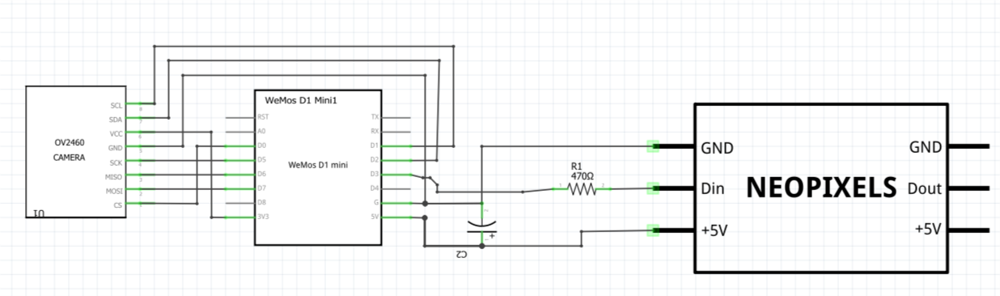

# water-meter-house-automation
ESP8266 software for a water meter measurement based on an ArduCAM, ESP8266 and WS2812-LED illumination

## Functionality

This is an HTTP-Webserver, sending an image of an ArduCAM (OV2640) on request and additionally switching on illumination.
The code is implemented in the Arduino IDE and is directly related to an selfmade water meter for house automation. 
For the housing etc. see  [https://www.thingiverse.com/thing:3238162](https://www.thingiverse.com/thing:3238162)

An overview about the complete system can be seen here: [https://github.com/jomjol/water-meter-measurement-system](https://github.com/jomjol/water-meter-measurement-system)

### Commands
- http://IP-ADRESS/lighton   -   Switching the LED-lights on
- http://IP-ADRESS/lightoff - Switching the LED-lights off
- http://IP-ADRESS/capture_with_light - Turn light on, send JPG, Turn light off
- to be extended in future versions ...

### Compling Code
The Arduino Code is in the subdirectory "ArduCAM_Server-NodeMCU-OTA_GitHub". In order to compile the ESP8266 for NodeMCU and the Neopixel Library needs to be installed through the Arduino Library Controll.
The WLAN-SSID and PASSWORD needs to be updated in the code, in order to access the local network.

### Code structure - brief overview
The code is implemented in C++, using different classes.
#### JomjolGitServerClass
- Basic class to implement HTTP-server
#### JomjolGitArduCAMComm
* Class to communicate with ArduCAM and LEDs
#### JomjolGitArduCAM-Server-Class
- Inherited class of Server and ArduCAM to combine physical camera controll and HTTP-server
#### ArduCAM_Server-NodeMCU-OTA_GitHub.ino
* Arduino file to setup and loop the programm. Additianlly implementin an OTA-interface to update the NodeMCU via Arduino IDE

## Physical Setup / Wiring / Components

### Components
- ArduCAM OV2640 with JPG-Output
- Node Mini D1 with ESP8266
- LED-Strip with WS2812b-Controller
- Capacity 1000uF
- Resistor 470 Ohm

### Wiring

