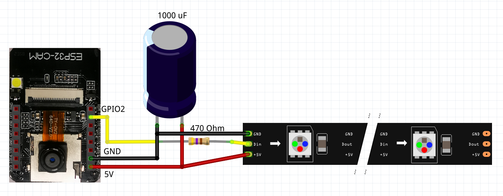
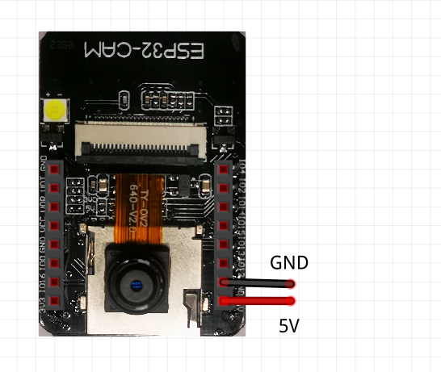

# water-meter-house-automation
Software for a water meter measurement to provide an JPG-Image of a watermeter with an OV2640 camera with internal flash LED or WS2812-LED illumination

## Changelog
##### 2.3.0 ESP32-CAM only
* Improved Watchdog
* Implementation of OTA update modus
* Parametrized Delay (default = 2.5s)

#### [Full Change History](Changelog.md)

#### ESP32-CAM - Software
* [ESP32-CAM_Server-GitHub](ESP32-CAM_Server-GitHub)
* Flashing onto the board is done using an FTDI-Flasher and the board is addressed as "ESP32-Wrover Module"

## Functionality

This is an HTTP-Webserver, sending an image of the OV2640 camera on request and additionally switching on illumination.
The code is implemented in the Arduino IDE and is directly related to an selfmade water meter for house automation. 
For the housing etc. see  [https://www.thingiverse.com/thing:3860911](https://www.thingiverse.com/thing:3860911)

An overview about the complete system can be seen here: [https://github.com/jomjol/water-meter-measurement-system](https://github.com/jomjol/water-meter-measurement-system)

### Commands
- http://IP-ADRESS/lighton   -   Switching the LED-lights on
- http://IP-ADRESS/lightoff - Switching the LED-lights off
- http://IP-ADRESS/capture - Returns a single image
- http://IP-ADRESS/capture_with_light - Turn light on, send JPG, Turn light off

Usefull for ESP32-CAM with onboard flash LED only:

- http://IP-ADRESS/flashon   -   Switching the onboard LED-flash on (GPIO4)
- http://IP-ADRESS/flashoff - Switching the onboard LED-flash off (GPIO4)
- http://IP-ADRESS/capture_with_flashlight - Turn internal flash light on, send JPG, Turn flash light off
- to be extended in future versions ...

The picture properties and the illumination can be adjusted by adding the following parameters. The parameters can be used indivdually or combinded:
- http://IP-ADRESS/capture?quality=10&size=UXGA - Picture with high quality and resolution 1600x1200 pixel
- http://IP-ADRESS/capture_with_flashlight?quality=10&size=UXGA - Picture with high quality and resolution 1600x1200 pixel
- http://IP-ADRESS/capture_with_flashlight?delay=5000 - Waiting time between turning on the light and taking the picture in milliseconds (default value is 2500ms)

Meaning of parametes:

| Parameter | Meaning | Range/Value | Example |
|:---------|:-------|:-----|:--------|
| quality  | Quality setting for jpeg | 0 - 63 (0 = highest quality; 63 = lowest quality, default = 10 | quality=10 |
| size | JPEG resolution of out put | QVGA (320x240), VGA (640x480), SVGA (800x600), XGA (1024x768), SXGA (1280x1024), UXGA (1600x1200), default = SVGA | size=SVGA |
| delay | Waiting time between light on and take a picture | Time in ms | delay=5000 |

### Info to Watchdog
In some cases my ESP32-CAM get stuck without any reaction. The reason for this is unknown. To restore it a reboot is necessary. I implemented a watchdog, that triggers after 30 minutes. It is reseted allways after taking a picture. As my system takes pictures every 10 minutes, it should only fire in case it gets stuck.

### Compling Code
The Arduino Code is in the subdirectory "ESP32-CAM_Server-GitHub". In order to compile, the ESP32 developement environment for ESP32-CAM and the Neopixel Library needs to be installed through the Arduino Library Controll.
The WLAN-SSID and PASSWORD needs to be updated in the code, in order to access the local network. After turning on the power, it flashed 3 time the onboard LED, after a successfull connection to the WLAN.

### Code structure - brief overview
The code is implemented in C++, using different classes.
#### JomjolGitServerClass
- Basic class to implement HTTP-server
#### JomjolGitESP32CamComm
* Class to communicate with ArduCAM/ESP32-CAM and LEDs
#### JomjolGitArduCAM-Server-Class
- Inherited class of Server and ArduCAM/ESP32-CAM to combine physical camera controll and HTTP-server
#### ESP32-CAM_Server-GitHub.ino
* Arduino file to setup and loop the programm and an OTA-interface to update the NodeMCU over-the-air

# Physical Setup / Wiring / Components

## ESP32-CAM

### Components
- ESP32-CAM mit OV2640
- LED-Strip with WS2812b-Controller
- Capacity 1000uF
- Resistor 470 Ohm

### Wiring including LED-Strip

### Wiring for usage internal ESP32-CAM flash LED only

