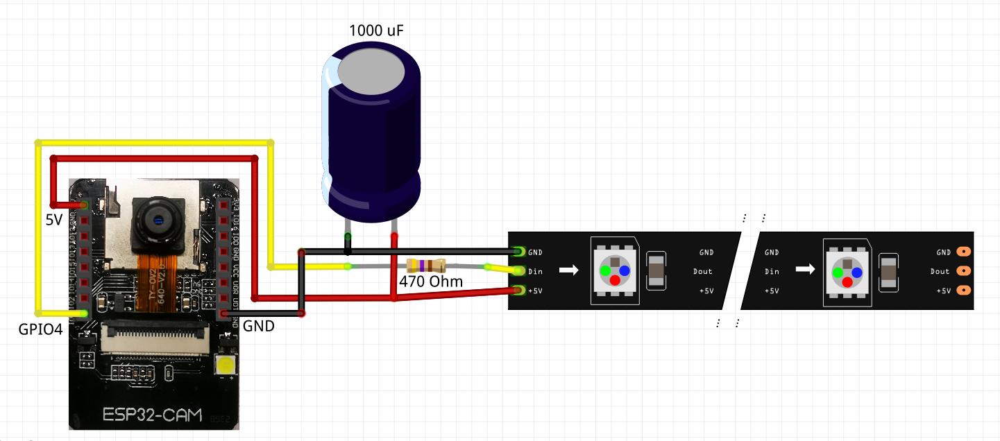

# water-meter-house-automation
Software for a water meter measurement to provide an JPG-Image of a watermeter with an OV2640 camera and a WS2812-LED illumination

There are two code versions available:

#### Main Version for NodeMCU
* [ArduCAM_Server-NodeMCU-OTA_GitHub](ArduCAM_Server-NodeMCU-OTA_GitHub)
* The main code - tested and working with NodeMCU hardware and fitting to the wiring below.

#### ESP32-CAM Version
* [ESP32-CAM_Server-GitHub](ESP32-CAM_Server-GitHub)
* Flashing onto the board is done using an FTDI-Flasher and the board is addresses as "ESP32-Wrover Module"

## Functionality

This is an HTTP-Webserver, sending an image of the OV2640 camera on request and additionally switching on illumination.
The code is implemented in the Arduino IDE and is directly related to an selfmade water meter for house automation. 
For the housing etc. see  [https://www.thingiverse.com/thing:3238162](https://www.thingiverse.com/thing:3238162)

An overview about the complete system can be seen here: [https://github.com/jomjol/water-meter-measurement-system](https://github.com/jomjol/water-meter-measurement-system)

### Commands
- http://IP-ADRESS/lighton   -   Switching the LED-lights on
- http://IP-ADRESS/lightoff - Switching the LED-lights off
- http://IP-ADRESS/capture_with_light - Turn light on, send JPG, Turn light off
- to be extended in future versions ...

### Compling Code
The Arduino Code is in the subdirectory "ArduCAM_Server-NodeMCU-OTA_GitHub" for the NodeMCU version and "" for the ESP32-CAM version. In order to compile the ESP8266 for NodeMCU, the ESP32 developement environment for ESP32-CAM and the Neopixel Library (for both versions) needs to be installed through the Arduino Library Controll.
The WLAN-SSID and PASSWORD needs to be updated in the code, in order to access the local network.

### Code structure - brief overview
The code is implemented in C++, using different classes.
#### JomjolGitServerClass
- Basic class to implement HTTP-server
#### JomjolGitArduCAMComm / JomjolGitESP32CamComm
* Class to communicate with ArduCAM/ESP32-CAM and LEDs
#### JomjolGitArduCAM-Server-Class
- Inherited class of Server and ArduCAM/ESP32-CAM to combine physical camera controll and HTTP-server
#### ArduCAM_Server-NodeMCU-OTA_GitHub.ino / ESP32-CAM_Server-GitHub.ino
* Arduino file to setup and loop the programm. For NodeMCU version additianlly implementin an OTA-interface to update the NodeMCU over-the-air

# Physical Setup / Wiring / Components

## Node Mini D1 /ArduCam OV2640

### Components
- ArduCAM OV2640 with JPG-Output
- Node Mini D1 with ESP8266
- LED-Strip with WS2812b-Controller
- Capacity 1000uF
- Resistor 470 Ohm

### Wiring

## ESP32-CAM

### Components
- ESP32-CAM mit OV2640
- LED-Strip with WS2812b-Controller
- Capacity 1000uF
- Resistor 470 Ohm

### Wiring

